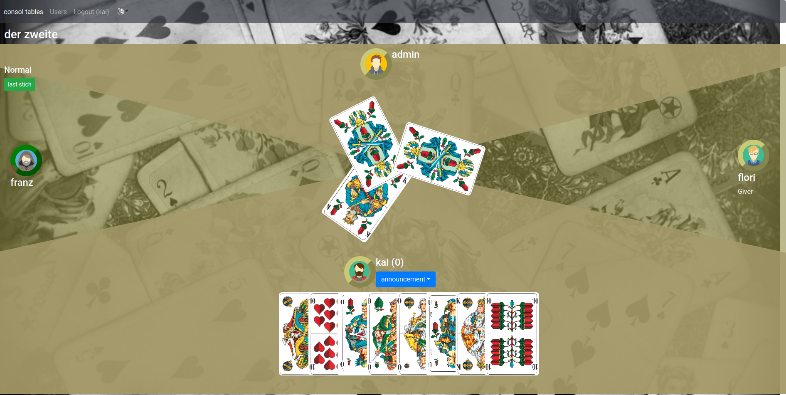

# doppelkopf-multi
Doppelkopf -->  sometimes abbreviated to Doko, is a trick-taking card game.
 
 It is a multiplayer Doppelkopf game. You can add tables and user. Users can play a game or view a game.

Play Table

## Support
### Languages
- Englisch
- German
- Sorbian (Upper Sorbian/ hornjoserbska rěč)

 ## Configurations
 ### Default
 - default user: admin and password: admin.
 - port: 8080

## build and run
`git clone doppelkopf-multi`

### Docker

1. Build the images `docker-compose build`
1. Run the as container `docker-compose up -d`

#### Posableites
To change the port of the client, at docker compose file change the client ports item `8080:80` to `xxxx:80`.

### local

#### api 
1. packages reload `dotnet reload`
1. start start api local `dotnet run`
1. build the api `dotnet build`

#### client 
1. install packages `yarn`
1. start the angular app local `yarn start`
1. build the angular app `yarn build`
