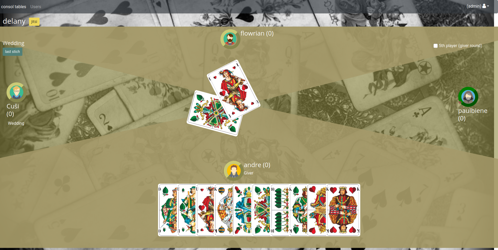
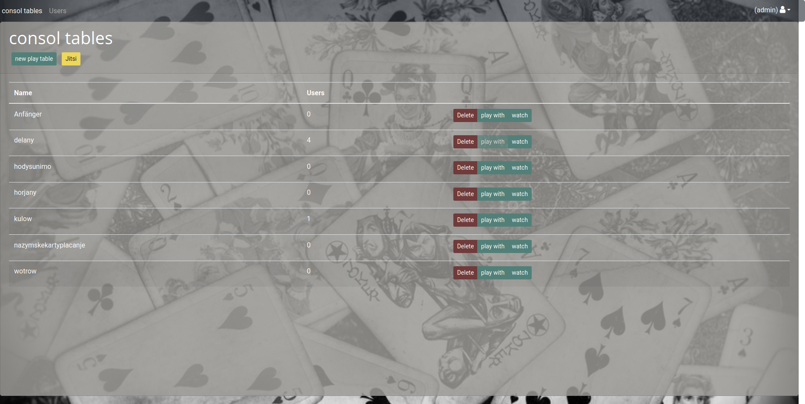

# Doppelkopf Multiplayer
Doppelkopf -->  sometimes abbreviated to Doko, is a trick-taking card game.
 
It is a multiplayer Doppelkopf game, with a server and client. You can add tables and user. Users can play a game or view a game.

## Features

This game is still a work in progress. You will see that it's playable but some features are still missing that you might know from other Doppelkopf games:

* [x] Playing multiple rounds
* [x] Custom rules
* [X] Game Variant
    * Normal
    * Wedding
    * Solo
    * Queen Solo
    * Jack Solo
    * Ace Solo
    * Suit Solo
    * King Solo
    * Color Solo Clubs
    * Color Solo Diamonds
    * Color Solo Hearts
    * Color Solo Spades
* [x] Score calculation
* [x] Announcement
* [x] Shuffle curds
* [ ] Playing solo
* [ ] Single player mode

Play Table

TableList

## Support
### Languages
- Englisch
- German
- Sorbian (Upper Sorbian/ hornjoserbska rěč)

 ## Configurations
 ### Default
 - default user: admin and password: admin.
 - port: 8080

## build and run
`git clone doppelkopf-multi`

### Docker

1. Build the images `sh build-docker`
1. Environment properties in the env files (db.env, ap-settings.env)
1. Check the `docker-compose`, optional change. 
1. Run the as container `docker-compose up -d`

#### Possibilities
To change the port of the client, at docker compose file change the client ports item `8080:80` to `xxxx:80`.

### local

#### api 
1. packages reload `dotnet reload`
1. start start api local `dotnet run`
1. build the api `dotnet build`

#### client 
1. install packages `yarn`
1. start the angular app local `yarn start`
1. build the angular app `yarn build`
